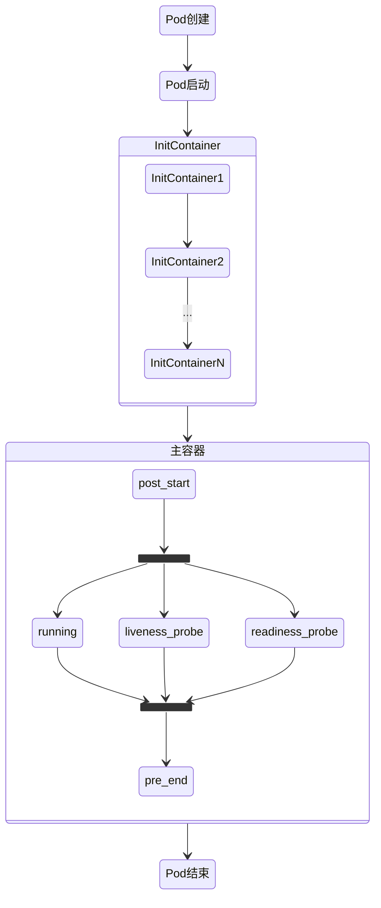

## 一. k8s基本概念

### 1.1 k8s架构

k8s为主从架构，主要包含master/node两部分

#### 1.1.1 master

Master 节点是 k8s 集群的控制节点，负责整个集群的管理和控制，一般有3个master用作高可用。Master 节点上主要包含以下组件：

- `kube-apiserver`：集群控制的入口，提供 http服务，为restful接口
- `kube-controller-manager`：k8s 集群中所有资源对象的自动化控制中心
- `kube-scheduler`：负责 Pod 的调度

#### 1.1.2 node

Node是 k8s 集群中的工作节点，Node 上的工作负载由 Master 节点分配，工作负载主要是运行容器应用。Node 节点上包含以下组件：

- `kubelet`：负责 Pod 的创建、启动、监控、重启、销毁等工作，同时与 Master 节点协作，实现集群管理的基本功能。
- `kube-proxy`：实现 k8s Service 的通信和负载均衡
- `容器引擎`：运行容器化(Pod)应用，一般为docker

### 1.2 其他名词

#### 1.2.1 Pod

Pod 是 k8s 最小的部署调度单元。每个 Pod 可运行一个或多个业务容器。若运行多个容器，常为一个主容器+其他辅助容器的形式，多个容器共享NET、UTS、IPC名称空间，还共享存储卷

#### 1.2.2 Label和Label Selector

Label是键值对形式的meta数据，用于区分k8s中各种对象（不同类型对象，或者同类型对象的不同个体），使用Label Selector可用于筛选满足条件的对象

#### 1.2.3 Pod控制器

用于控制pod数量的控制器，为满足不同的场景，常用有如下几种：

* `ReplicationController`  副本控制器，控制同一类pod对象的副本数量，精确符合定义的数量；还能滚动更新（更新时可临时改变副本数量）
* `ReplicaSet` 不直接使用，而是使用Deployment

* `Deployment` 只能管理无状态的应用，还支持二级控制器HPA（HorizontalPodAutoscaler），自动伸缩pod数量

* `StatefulSet`  管理有状态的应用

* `DaemonSet`  在每个node上运行一个副本，而不是随意运行

* `Job`  运行作业，有些程序执行完就可以结束了，这种不需要一直运行的，就可以把它们运行为Job；但是如果是意外中断的，就需要恢复运行

* `Cronjob`  周期运行作业

#### 1.2.4 Service

pod删除后，会通过pod控制器重新拉起来，但是新pod的ip、主机名等信息都会变化，如果以配置的方式访问pod中的服务，服务是不可用的，因此需要有服务发现的功能。k8s为每一组提供同类服务的pod和它的客户端之间，添加了一个中间层，这个中间层叫做Service。

Service只要不删除，其名称和地址都是固定的。service通过`Label Selector`识别并关联pod，并动态探测其IP，以后客户端访问pod的服务，都通过service做代理

service实际是iptables或者ipvs规则，其ip实际是不存在的，因此直接ping不通

#### 1.2.5 dns

客户端通过名称访问service，需要有dns解析，因此需要dns服务器，一般由dns pod提供（这种被称为集群的AddOns（附件））

#### 1.2.6 etcd

etcd为master存储集群信息的数据库，一般也会有多份以支持高可用，只有通过ApiServer可以操作

#### 1.2.7 namespace

不同于linux上资源隔离的namespace，k8s的namespace貌似只是对其对象分组，方便管理

### 1.3 总结

## 二. 搭建k8s集群

k8s有两种部署方式，一种直接在可各node上部署服务，但是比较麻烦，还需要生成很多对证书；另一种则是以pod方式部署，使用部署工具如`kubeadm`

这里介绍的第二种方式，`kubeadm`托管在github上[Kubernetes · GitHub](https://github.com/orgs/kubernetes/repositories?page=2)


**前提**

1. 各node能通过`/etc/hosts`文件互相解析

2. 各node有时间服务器同步时间

3. `iptables`和`firewall`不启动，因为k8s会有操作（可设置为开机不启动）

   ```shell
   systemctl status firewall.service
   systemctl stop firewall.service
   ```

   

### 2.1 安装k8s相关组件

（如果以第一种方式部署，在github上`kubernetes`仓库的`kubernetes`项目下，找到`release`（此处看到的是源码包），找到`CHANGELOG`，有对应平台的安装包，master和node节点都是安装`Server`包，`client`包是用于和server交互的）

#### 2.1.1 

第二种方式应该安装`kubeadm`，`kubelet`，`docker`等，使用国内镜像会更快安装[(阿里云开源镜像站资源目录)](https://mirrors.aliyun.com/kubernetes/yum/repos/kubernetes-el7-x86_64/repodata/)。

```shell
# 配置yum源
# docker-ce
cd /etc/yum.repos.d/
wget https://mirrors.aliyun.com/docker-ce/linux/centos/docker-ce.repo # repo文件是镜像网站上找的
# kubernetes 
# 添加repo文件内容如下
[kubernetes]
name=Kubernetes Repo
baseurl=https://mirrors.aliyun.com/kubernetes/yum/repos/kubernetes-el7-x86_64/ # 路径也是镜像网站上的，repodata的上一层路径
gpgcheck=1
gpgkey=https://mirrors.aliyun.com/kubernetes/yum/doc/rpm-package-key.gpg  # key也是网站上的，是rpm-package-key这个
enabled=1

yum repolist
yum install docker-ce kubelet kubeadm kubectl
```

#### 2.2.2

环境准备，前3步所有节点都需要执行

```shell
# 禁用防火墙
systemctl stop firewalld
systemctl disable firewalld

# 禁用SELINUX
setenforce 0
cat /etc/selinux/config # 修改 SELINUX=disabled

# 若docker的cgroupdriver为cgroups，需要修改为systemd
# 查看
docker info | grep cgroup
# 修改，在 /etc/docker/daemon.json中添加
{
	"exec-opts":[
		"native.cgroupdriver=systemd"
	]
}
# 生效
systemctl daemon-reload
systemctl restart docker

# 创建 
# 因为随后docker会操作iptables以生成一些规则，为了方便后续操作
vim /etc/sysctl.d/k8s.conf # 写入
net.bridge.bridge-nf-call-ip6tables = 1
net.bridge.bridge-nf-call-iptables = 1
net.ipv4.ip_forward = 1
# 生效
modprobe br_netfilter
sysctl -p /etc/sysctl.d/k8s.conf

```

#### 2.2.3 

外网不可访问，提前下载镜像

```shell
# 1. 把之前设置的代理去掉
# 2. 查看应该安装的镜像版本
[root@localhost ~]# kubeadm config images list
k8s.gcr.io/kube-apiserver:v1.22.4
k8s.gcr.io/kube-controller-manager:v1.22.4
k8s.gcr.io/kube-scheduler:v1.22.4
k8s.gcr.io/kube-proxy:v1.22.4
k8s.gcr.io/pause:3.5
k8s.gcr.io/etcd:3.5.0-0
k8s.gcr.io/coredns/coredns:v1.8.4
# 3. 去阿里云那儿pull镜像，把 k8s.gcr.io 替换为 registry.aliyuncs.com/google_containers
# 4. 打tag，把阿里的tag换成 k8s.gcr.io

```

或者使用代理下载

```shell
vim /usr/lib/systemd/system/docker.service
#[Service]下添加以下内容
Environment="HTTPS_PROXY=http://www.ik8s.io:10080"
Environment="NO_PROXY=127.0.0.0/8,172.20.0.0/16"

# 退出后重启服务
systemctl daemon-reload
systemctl restart docker
docker info # 可查看刚添加的变量
```


```shell
systemctl enable kubelet
systemctl enable docker

# systemctl启动服务失败，可以这样看日志
# 1. systemctl status {service}
# 2. tail /var/log/messages
```

#### 2.2.4 

接下来应该初始化kubeadm，使用`kubeadm init --help`可查看其选项

* `--apiserver-advertise-address`: 要监听的地址，默认0.0.0.0
* `--apiserver-bind-port`：要监听的端口，默认6443
* `--cert-dir`：加载证书的目录，默认 /etc/kubernetes/pki
* `--config`：自己的配置文件
* `--ignore-preflight-errors`：预检查时如果遇到错误可以忽略
* `--kubernetes-version`：k8s的版本
* `--pod-network-cidr`：pod使用的网络
* `--service-cidr`：service的网络地址

```shell
# 执行初始化命令
kubeadm init --kubernetes-version=v1.99.1 --pod-network-cidr=10.244.0.0/16 --service-cidr=10.96.0.0/12
```

若出现ERROR Swap错误，这样解决

```shell
# 错误
 [ERROR Swap]: running with swap on is not supported. Please disable swap
 
 # 解决方式
 # step1. kubelet配置文件增加参数，指明额外的初始化选项
 vim /etc/sysconfig/kubelet
 KUBELET_EXTRA_ARGS="--fail-swap-on=false"  # 如果如果swap on，不让它出错
 # step2. 执行命令添加参数  --ignore-preflight-errors=Swap
 kubeadm init --kubernetes-version=v1.99.1 --pod-network-cidr=10.244.0.0/16 --service-cidr=10.96.0.0/12 --ignore-preflight-errors=Swap
```


```shell
# 检查master服务是否健康
kubectl get cs 

# 若出现  scheduler            Unhealthy
# 可修改两个配置文件，注视掉 port=0的一行
/etc/kubernetes/manifests/kube-controller-manager.yaml
/etc/kubernetes/manifests/kube-scheduler.yaml

# 然后重启kubelet服务
```


此时执行`kubectl get nodes`，master节点还是Noteady的状态，因为还未部署网络插件，这里我们使用`flannel`插件[https://github.com/flannel-io/flannel](https://github.com/flannel-io/flannel)

找到 `Deploying flannel manually`可看到手动部署的命令

```shell
kubectl apply -f https://raw.githubusercontent.com/coreos/flannel/master/Documentation/kube-flannel.yml
```

等待一会儿，直到`docker image ls`可查看到flannel的镜像，并且`kubectl get pods`查看不到内容，因为默认查看的是`default`名称空间，这些系统级的pod已经被挪到`kube-system`名称空间了

```shell
kubectl get pods -n kube-system
```

##### 2.2.5 

加入其他node

```shell
kubeadm join 192.168.153.131:6443 --token 4v5prq.to8l8xk7i8w86tyx --discovery-token-ca-cert-hash sha256:ee27de95a6c643fc6314a29c6f472a7fcfe821f1b4293198d091f17f5dcfc2d3
```


## 三. 快速入门

* 创建deployment，并运行指定副本数

  ```shell
  kubectl create deployment --name=nginx-deploy --image=nginx:1.21.4-alpine --port=80 --replicas=1
  ```

* 扩缩容

  ```shell
  kubectl scale --replicas=3 deployment nginx-deploy
  ```

* 给deployment创建service

  ```shell
  kubectl expose deployment nginx-deploy --name=nginx-service --port=80 --target-port=80 --protocol=TCP
  ```

  没指定类型的service默认为`ClusterIP`，只能在集群内访问。指定成`NodePort`会对外映射一个端口，则可以在集群外访问

* 更新镜像

  ```shell
  kubectl set image deployment nginx-deploy {container_name}={new_image}
  ```

  

* 查看更新和回滚

  ```shell
  # 查看更新
  kubectl rollout status deployment nginx-deploy 
  
  # 回滚
  kubectl rollout undo deployment nginx-deploy --to-revision={version} # 不指定版本默认到上一个版本
  ```

## 四. k8s资源

### 4.1 资源分类

k8s中，各种操作对象都是当做资源来管理的，资源实例化后就是一个对象，核心资源大概有以下类：

namespace级资源

* workload资源，工作负载类资源对象，包括pod和pod控制器（deployment、Replicaset、Statefulset、DaemonSet、Job、Cronjob）
* 服务发现与均衡类资源，包括Service和Ingress
* 配置与存储类资源，包括各种volume，CSI（容器存储接口，用以扩种第三方存储卷），块存储或云存储、分布式存储或网络存储、节点级存储、临时存储
  * 两种特殊的存储卷，ConfigMap（当做配置中心使用的资源类型）、Secret（与ConfigMap一样，用以保存敏感数据）
  * DownwardAPI 用于把外部的数据输入给容器

集群级的资源

* namespace 、Node、Role、ClusterRole、RoleBinding、ClusterRoleBinding

元数据型资源

* 用来提供元数据，如HPA、PodTemplate、LimitRange

### 4.2 配置清单创建pod

创建pod资源的方法有3种：直接使用命令，命令式资源清单，声明式资源清单（资源尽可能向声明的状态对齐，并可以随时改变声明）

#### 4.2.1 获取pod信息

* `kubectl get pod {pod_name} -o yaml` # 以yaml格式输出pod信息

  * `apiVersion`: 该资源所属集群的api组名称和api版本，省略组名默认为core组
  
    可通过`kubectl api-versions`查看所有的类别。pod是最核心的资源，所以属于core群组；pod控制器是应用程序管理的资源，属于apps群组中
  
    version常有alpha(内测，有些后续可能没有了)、beta(公测，接口大部分稳定)、stabel(稳定版)

  * `kind`: 资源类别，如Pod，Deployment等
  
  * `metadata`: 元数
  
    * name
    * namespace
    * lables
    * annotations
  
  * `spec`: specification，该资源具有的规格，用户定义的资源的期望状态。可写
  
  * `status`: 当前资源的当前状态。只读
  
  k8s即是资源的当前状态无限接近预期状态，以满足用户的期望
  
  

apiserver仅接受json格式的资源定义，以yaml格式提供配置清单，apiserver会自动将其转换为json。

`kubectl explain pods[.metadata]`,查看资源类型的yaml定义字段，大部分资源都可由上述5种顶级字段定义

每个资源的引用path，通常为：`/api/[{group}/]{version}/namespaces/{namespace}/{kind}/{name}`

#### 4.2.2 一个简单的命令式资源清单yaml

```yaml
apiVersion: v1
kind: Pod
metadata:
	name: pod_demo
	namespace: default
	labels:
		app: myapp
		tier: frontend
	annotations:
		user: admin
spec:
	containers:
	- name: myapp
	  image: ikubernetes/myapp:v1
	- name: busybox
	  image: busybox:latest
	  command:
	  - "/bin/bash"
	  - "-c"
	  - "date >> /usr/bin/nginx/html/index.html; sleep 5"
```

使用`kubectl create -f file.yaml`即可按yaml配置创建出pod，内含两个容器。pod内含多个容器，可能部分正常运行，而另一部分异常；各容器的文件系统是隔离的

可使用`kubectl delete -f file.yaml`删除pod

**注意**：pod内容器的生命周期可能很短，执行完就正常返回了，所以可能看到pod的状态总是在`CrashBackOff`

#### 4.2.3 pods.spec.containers字段详解

`spec`指pod的预期状态，其中containers用于指定容器的预期状态，可使用`kubectl explain pods.spec.containers`查看详情，是个对象列表，每个对象字段大概有如下：
 - `name`: \<string\> pod名称
- `image`: \<string\> 使用的镜像

* `imagePullPolicy`: \<string\> 当镜像标签为`:latest`时，默认为Always，否则为IfNotPresent。==该字段不能动态更新==（即创建pod后，不能再被修改）

  * Always: 总是更新
  * Never: 从不更新
  * IfNotPresent: 当前有就不更新，没有就更新

* `ports`: \<[]Object\> 指定这个ports不会影响容器暴露端口，容器该暴露的还是会暴露，而且因为集群内是叠加网络，其他的pod都能访问到这个服务。指定这个只是用于说明有使用这个端口，字段有：

  * containerPort: 暴露的端口
  * hostIP: 因为pod所在的节点是不一定的，若要指定应该为0.0.0.0
  * hostPort: containerPort映射到节点的端口，==需要和containerPrt一致==
  * name: 可指定名称，便于引用该端口
  * protocol: [UDP|TCP|SCTP]，默认TCP

* `command`: 相当于docker的 `EntryPoint`

* `args`： 相当于docker的`CMD`

  * command和args都没指定时：使用docker的EntryPoint和CMD，CMD做参数
  * 只指定command时：只执行command命令，没有参数
  * 只指定args时：使用docker的EntryPoint和args，args做参数
  * command和args都指定时：使用指定的command和args，args做参数

  复习一下docker file

  **RUN**：在`docker build`过程中执行，系统默认以`/bin/sh -c`来运行它

  **CMD**：在`docker run`过程中执行，若有EntryPoint，则当做EntryPoint的参数

  **ENTRYPOINT**：容器指定的默认运行的程序

#### 4.3.4 pods.metadata字段详解

* `labels`: 标签，key=value形式定义，可动态修改。key、value最长为63字符

  使用`kubectl get pods`加参数可显示标签

  * `--show-labels` 显示每个pod的所有标签
  * `-L {label_name}`可显示每个pod指定标签的值，label_name可用逗号隔开指定多个

  ```shell
  [root@master ~]# kubectl get pods -L app,Run
  NAME            READY   STATUS    RESTARTS   AGE   APP    RUN
  pod-from-yaml   2/2     Running   0          42m   app1
  ```

  动态修改使用`kubectl label`命令，如果原标签已存在，需要添加`--override`参数更新

  ```shell
  # kubectl label TYPE NAME KEY_1=VAL_1... --override
  kubectl label pods pod-from-yaml release=canary
  ```

* `annotatons`: 注解，注解和标签一样，都是以key=value形式提供，可动态修改。

  不同点是，注解不可以用作标签选择器，只能用于为对象提供元数据；且key、value没有长度的限制

#### 4.2.4 标签选择器

##### 1. 显示时使用标签选择器

`kubectl get`命令，加上参数`-l`可使用标签选择器，用于过滤获取的资源对象（不一定是pod资源，也可以是其他资源）

标签选择器有两大类，等值关系和集合关系

* 等值关系：使用`=|==|!=`进行判断(两个等号和一个等号是一样的)

  ```shell
  kubectl get pods -l app!=myapp,release=canary  # 显示所有app标签值不为myapp，且release标签值为canary的所有pod
  ```

* 集合关系：使用`KEY|!KEY|in|not in`进行判断

  ```shell
  kubectl get pods -l app  # 显示有app标签的所有pods
  kubectl get pods -l "app in (myapp,yourapp)" # 显示所有app标签的值在这个集合中的pods
  ```

  **注意：**条件可以有多个，每个使用逗号间隔；单个套件中间有空格时，需要加引号

##### 2. 定义资源时使用标签选择器

很多资源支持内嵌字段的形式定义标签选择器，字段有：

* `matchLabels`: 直接以key=value的形式给出

* `matchExpressions`: 以表达式的形式给出，形如

  ```shell
  {key:"KEY" operator:"OPERATOR" values: "VALUES"}
  ```

  operator常有：In/NotIn/Exists/NotExists

##### 3. 节点选择器

在定义pod时，可指定pod倾向于被调度的node，使用`pods.spec.containers`同级的字段：

* `nodeSelector <map[string]string>`: 通过标签指定
* `nodeName <string>`: 直接指定节点

### 4.3 Pod生命周期

#### 4.3.1 Pod生命周期时序图



* Pod创建到Pod启动这段时间，通常很短可以忽略不计

* InitContainer通常用于主容器启动前的环境设定，可能有多个InitContainer，多个之间串行执行，每个InitContainer运行完都自动退出。

* 主容器刚启动时和结束前，有post_start和pre_end两段时间供用户自定义操作

* post_start之后，一般就可以有pod健康检测了

  * `liveness probe`: 存活状态检测，检测主容器是否处于运行状态
  * `readiness probe`: 就绪状态检测，检测容器中的主进程服务是否正常

  两种probe都能执行3种行为：1. 自定义命令 2. 向指定的tcp套接字发送请求 3. 向指定的http服务发请求

##### 1.Pod创建流程

1. 用户创建Pod的请求发送到apiserver
2. apiserver保存请求到etcd，并向scheduler请求调度，然后把调度的结果存到etcd
3. 节点的kubelet拿到用户要创建的清单，在当前节点上创建并启动pod，并把结果返回给apiserver
4. apiserver把结果存到etcd

#### 4.3.2 Pod状态

* Pending：挂起，可能是某些条件未满足，调度还未完成
* Running：运行状态
* Failed：
* Succeeded:
* Unknown：未知状态，Pod的状态是apiserver与运行该pod的节点上的kubelet通信获取的，如果通信失败，就会导致Unknown

#### 4.3.3 pods.spec.restartPolicy

* `Always`: 默认值。Pod结束总是重启，不论是正常结束还是异常结束。由于Pod经常重启也会给服务器带来一定压力，常用的做法是，第一次重启立即执行，下一次延时重启，延时时间一直延长到300s
* `OnFailure`： Pod异常结束才重启
* `Never`: Pod结束就结束，不重启

Pod异常，一般不会直接kill掉，因为可能导致数据丢失，应该使其平滑终止，向每个容器发送终止信号15，并等待一个宽限期；宽限期到还未终止，再强行kill终止
