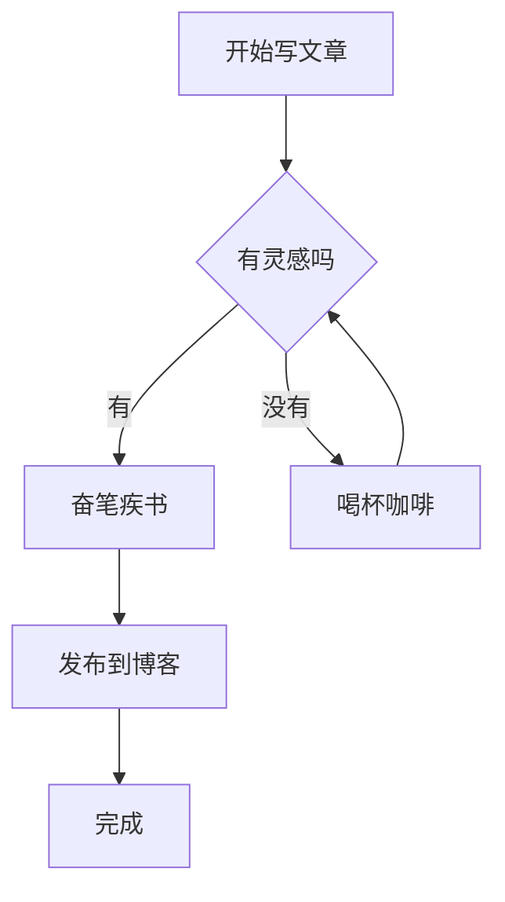
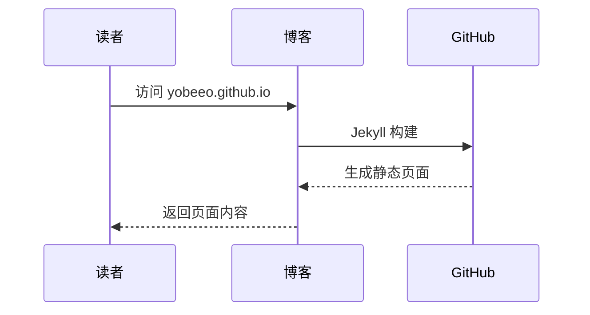

这是我的第一篇博客文章！本文演示了本站支持的各种写作功能。

<!--more-->

## Markdown 基础排版

### 文本样式

**粗体文字**、*斜体文字*、~~删除线~~、`行内代码`。

> 这是一段引用文字。
> 可以有多行。

### 列表

有序列表：

1. 第一项
2. 第二项
3. 第三项

无序列表：

- 🍎 苹果
- 🍌 香蕉
- 🍒 樱桃

### 表格

| 功能 | 状态 | 说明 |
|------|------|------|
| Markdown | ✅ | 基础排版 |
| 代码高亮 | ✅ | 支持多种语言 |
| KaTeX | ✅ | 数学公式 |
| Mermaid | ✅ | 流程图/时序图 |

---

## 代码块

### Python

```python
def fibonacci(n):
    """生成斐波那契数列"""
    a, b = 0, 1
    result = []
    for _ in range(n):
        result.append(a)
        a, b = b, a + b
    return result

print(fibonacci(10))
# [0, 1, 1, 2, 3, 5, 8, 13, 21, 34]
```

### JavaScript

```javascript
const greet = (name) => {
    console.log(`你好，${name}！`);
};

greet('世界');
```

---

## 数学公式（KaTeX）

行内公式：$E = mc^2$

独立公式：

$$
\int_{a}^{b} f(x) \, dx = F(b) - F(a)
$$

矩阵：

$$
\begin{bmatrix}
1 & 2 & 3 \\
4 & 5 & 6 \\
7 & 8 & 9
\end{bmatrix}
$$

贝叶斯定理：

$$
P(A|B) = \frac{P(B|A) \cdot P(A)}{P(B)}
$$

---

## 流程图（Mermaid）



## 时序图



---

## 插入图片


---

## 总结

这就是一篇 Jekyll 博客文章的基本格式。总结要点：

1. 文件放在 `_posts/` 目录
2. 文件名遵循 `YYYY-MM-DD-标题.md`
3. Front Matter 中指定 `layout: post`、`title`、`date`
4. 正文用 Markdown 编写
5. 可以嵌入代码、公式、图表

开始写你自己的文章吧！🚀
